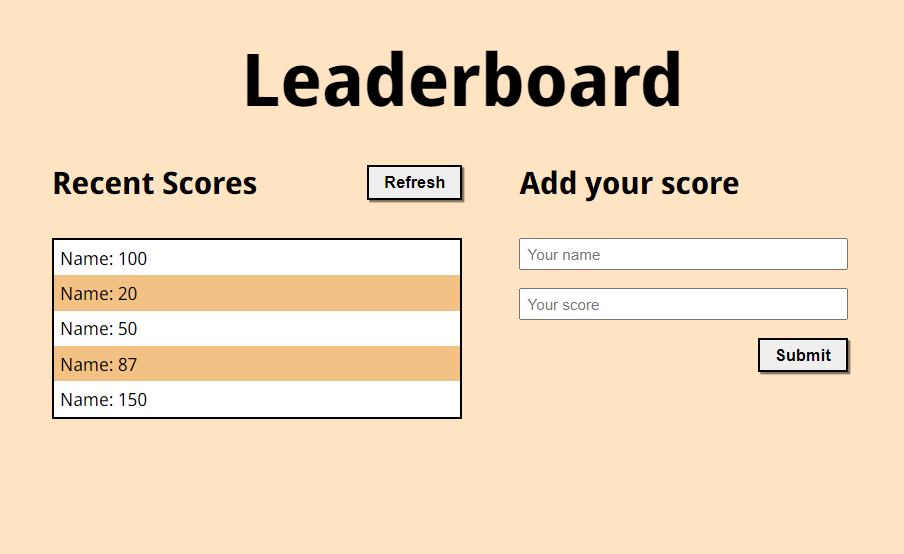

# Leaderboard

**What I did in this project:**

  1. Setup webpack.
  2. Make webpack generate files auto. on /dist directory.
  3. Make site structure with styling.
  4. Add linters files.

# Site Screenshots

## Built With

- HTML.
- CSS.
- Webpack.
- JavaScript.
- Linters.

## Install:

- Install node.js from [HERE](https://nodejs.org/en/).
  
## How to run locally:

1. Clone the project using git-bash or Githup Desktop.
2. Open the project folder with VSCode or any Editor.
3. Open terminal and navigate to the project folder.
4. Type npm install.
5. Type npm start.

## Authors

👤 **Omar Muhammad**

- GitHub: [@Omar-Muhamad](https://github.com/Omar-Muhamad)
- Twitter: [@Eng_OmarMuhamad](https://twitter.com/Eng_OmarMuhamad)
- LinkedIn: [@eng-omarmuhammad](https://www.linkedin.com/in/eng-omarmuhammad/)

## Show your support

Give a ⭐️ if you like this project!